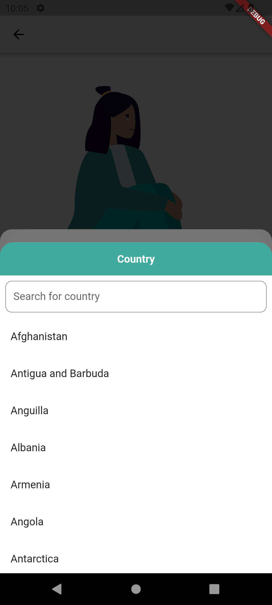
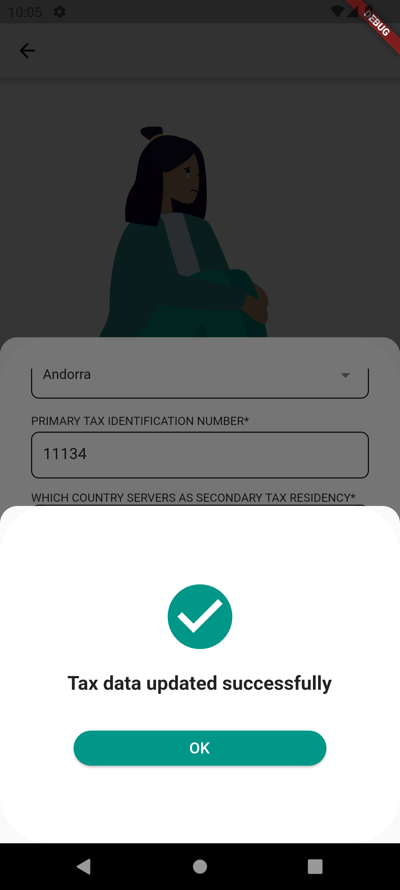

# Expatrio Coding Challenge

This code challenge app simplifies tax residency management with an intuitive login, a clear tax data updates, and an easy-to-use bottom sheet for information input and editing.
## Screenshots

 
 
 
 

## Libraries & Technology

- **Flutter SDK**: The core framework for building the app, enabling cross-platform development for iOS and Android from a single codebase.

- **Lottie** (v2.4.0): Used for integrating high-quality animations into the app, enhancing the visual appeal without the overhead of large video files.

- **URL Launcher**: Allows the app to open web URLs, including web pages, mail, SMS, or phone calls, providing a seamless interaction with external resources.

- **JSON Serializable (v6.1.6)**: Automates the process of serializing the complex objects into JSON format and vice versa, simplifying data manipulation and storage.

- **HTTP (v0.13.0)**: Facilitates communication with web servers, enabling the app to fetch data from or post data to the internet, essential for RESTful API interactions.

- **Flutter Secure Storage (v5.1.2)**: Offers a secure way to store sensitive information in the keychain of iOS and the keystore of Android, enhancing data security.

- **Flutter SVG (v2.0.9)**: Provides support for rendering SVG images, allowing for scalable graphics that look sharp across all screen resolutions.

- **Dropdown Search (v5.0.6)**: Implements customizable dropdown search widgets, improving user experience by making data selection more intuitive.

- **Mockito (v5.0.0)**: A versatile mocking framework for Dart and Flutter, designed to streamline the creation of mock objects in unit tests. Mockito enables precise control over external dependencies within tests, allowing for behavior verification, stubbing of method results, and argument matching.

## Project Structure

```
lib/
|- shared/
|- screens/
|- main.dart
```

## Getting Started

To run the project locally you need 
1. Flutter SDK
2. Android Studio or xcode 
3. Android emulator or IOS emulator
then run those commands: 

1. Clone repository

    ```bash
    git clone git@github.com:firasmehrez97/Expatrio-codingChallenge.git

    ```

2. Navigate to the project.

    ```bash
    cd Expatrio_codingChallenge
    ```

3. Start emulator.

3. Run.

    ```bash
    flutter run
    ```

## Future Improvements
1. Create more tests
2. Localization
3. Integration of firebase / ShoreBird etc ...

#### Thank you
